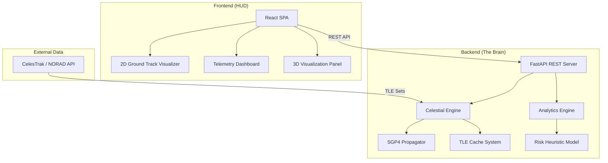

# 🛰️ Bellatrix Orbita

**Bellatrix Orbita** is a professional-grade, advanced orbital risk intelligence platform. It bridges the gap between raw NORAD tracking data and actionable orbital safety analytics, providing real-time visualization and collision risk assessment for over 27,000 objects in Earth's orbit.

[](LICENSE)
[](https://www.python.org/downloads/)
[](https://fastapi.tiangolo.com/)

🔗 **[Презентация проекта (Pitch-deck)](https://www.canva.com/design/DAHCmxTV5w0/c2jDxXRXJeKugYjrexCXOQ/edit?utm_content=DAHCmxTV5w0&utm_campaign=designshare&utm_medium=link2&utm_source=sharebutton)**

---

## 📖 Project Overview
Bellatrix Orbita is designed as a Minimum Viable Product (MVP) to demonstrate the integration of orbital mechanics with predictive analytics. It provides a strategic dashboard for monitoring the space environment, specifically focusing on Low Earth Orbit (LEO) safety.

**Key Capabilities:**
- **Real-time Tracking**: Live telemetry processing of satellite positions.
- **Predictive Analytics**: Heuristic collision risk modeling and stability forecasting.
- **Visual Intelligence**: Interactive 2D ground track mapping and sector analysis.
- **Reporting**: Automated generation of technical risk assessments in PDF and CSV.

## 🇷🇺 Описание проекта
**Bellatrix Orbita** — это аналитическая платформа для мониторинга орбитальных рисков. Проект объединяет данные слежения NORAD с продвинутыми алгоритмами (SGP4) для прогнозирования вероятности столкновений и визуализации траекторий спутников в реальном времени.

**Основные преимущества:**
- **Прогнозирование SGP4**: Высокая точность расчета положения объектов.
- **Аналитика рисков**: Оценка стабильности орбит и вероятности сближения.
- **Интерактивность**: Визуализация путей спутников на карте мира.
- **Отчетность**: Генерация PDF-отчетов о состоянии безопасности объектов.


## 🏗️ System Architecture

Bellatrix Orbita follows a decoupled **Client-Server Architecture** optimized for high-performance physics calculations and low-latency visualization.



---

## 🧠 Core Algorithms & Intelligence Models

### 1. SGP4 Propagation Model
The system uses the **Simplified General Perturbations #4 (SGP4)** algorithm to predict satellite positions. 
- **Input**: Two-Line Element (TLE) sets containing mean motion, inclination, eccentricity, etc.
- **Process**: Converts TLE data into TEME (True Equator Mean Equinox) coordinates.
- **Output**: State vectors (Position and Velocity) at any timestamp within a 90-180 minute window.

### 2. Risk Heuristic Analytics
Collision risk is evaluated using a weighted multi-factor scoring system:
- **Orbital Density**: Higher scores for objects in LEO (Low Earth Orbit) shells (400-900km).
- **Intersection Risk**: Polar orbits (inclination 80-100°) receive a priority boost due to high cross-orbital intersection probability.
- **Stability Index**: Analyzes the standard deviation of variance in predicted paths; higher variance results in a lower stability score.

### 3. Coordinate Transformation
Converts inertial TEME coordinates to Geodetic (Latitude/Longitude) by applying **Greenwich Sidereal Time (GST)** rotation corrections, enabling accurate 2D ground track mapping.

---

## 🛠️ Technology Stack

### Backend (The Brain)
- **FastAPI**: High-speed asynchronous Python framework.
- **SGP4 & Skyfield**: Industrial-standard libraries for orbital physics.
- **ReportLab**: Dynamically generates PDF risk reports.
- **SlowAPI**: Security and rate control.

### Frontend (The HUD)
- **React (v18)**: Component-based architecture for the glassmorphism UI.
- **Three.js**: Renders the 3D Earth and Satellite models (currently suspended for thermal protection).
- **CSS3**: Advanced dark-mode aesthetics with neon glowing accents.

---

## 🚀 Installation & Setup

### Standard Startup (One-Click)
The easiest way to launch the project on macOS or Linux:
```bash
chmod +x start_bellatrix.sh
./start_bellatrix.sh
```
This script will:
1. **Clean up**: Detect and terminate any existing processes on ports 8000 and 8084.
2. **Launch Backend**: Starts the FastAPI server on `http://localhost:8000`.
3. **Launch Frontend**: Starts a Python HTTP server on `http://localhost:8084` serving the UI.
4. **Auto-Open**: Automatically opens your default browser to the dashboard.

### Manual Startup
If you prefer manual control:
```bash
# 1. Install dependencies
pip install -r backend/requirements.txt

# 2. Start the Backend (Port 8000)
cd backend
python3 -m uvicorn main:app --host 0.0.0.0 --port 8000

# 3. Start the Frontend (In a new terminal)
python3 -m http.server 8084 --directory frontend
```

### Verification (Tests)
To verify the engine is performing calculations correctly, run:
```bash
cd backend && python3 -m pytest test_backend.py -v
```

---

## 📈 Roadmap
- [x] **v1.0**: Core SGP4 Engine & 3D Visualization.
- [x] **v1.1**: Reliability Update (Cache, Rate Limiting, PDF Export).
- [ ] **v1.2**: User Authentication & Saved Satellite Constellations.
- [ ] **v1.3**: Real-time Socket.io updates for telemetry.

---

## 📜 License
Licensed under the [MIT License](LICENSE).

**Data Attribution:** Data provided by NASA, ESA, SpaceX, CelesTrak, and NORAD.

---
**⭐ If you find Bellatrix useful, please consider giving it a star on GitHub!**

